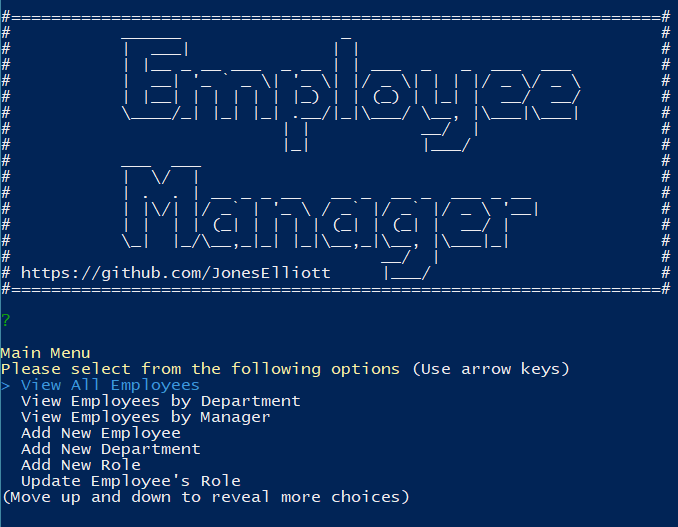
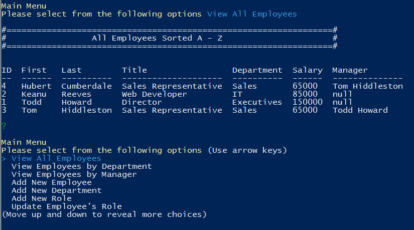
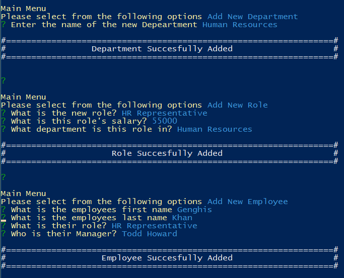
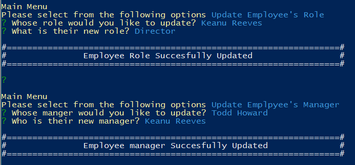

# Employee-Tracker

 

## Description

A CLI application that allows the management of employees

## Table of Contents

* [Installation](#installation)
* [Usage](#usage)
* [Contributing](#contributing)
* [Support](#support)
* [License](#license)

## Installation

#### Requires Node.js & MySQL

Create database with schema.sql and seed with seed.sql. Navigate to root folder of program in console, install dependecies using ```npm i``` cmmand. Program is executed via ```node .\app.js```

## Usage

On launch, main menu is displayed with the following options:

* View All Employees
* View Employees by Department
* View Employees by Manager
* Add New Employee
* Add New Department
* Add New Role
* Update Employee's Role
* Update Emplpyee's Manager



View All Employees, View Employees by Department, and View Employees by Manager query the database based on each of the parameters.



New Employees, Departments, and Roles can be added through throuhg their respective main menu options and following the on screen prompts.



Employee's roles and their manager can be updated as well.




## Contributing

No contributions are currently being accepted for this project.

## Support

For support regarding this project please contact me via GitHub

## License

This project is licensed under the MIT License.